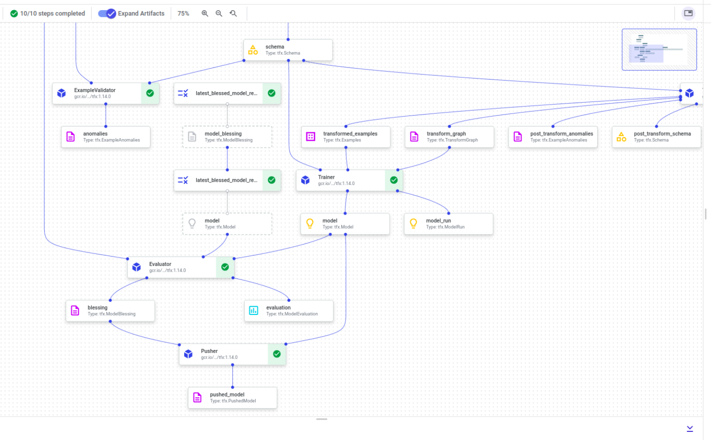

# Machine learning classification Pipelines 

## The dataset 


[Census Income dataset](https://archive.ics.uci.edu/ml/datasets/Adult)  


## Pipeline on Vertex AI





## How to use the model

Open your terminal and run these commands

```
docker pull hieudinhpro/census_api:v1

```
Run the server

```
docker run  -d -p  8000:8000 hieudinhpro/census_api:v1 

```
Wating 30s for loaded your app.
Let's do inference a example , open a new command line window or tab and run the following command:

```
curl -X 'POST' \
  'http://localhost:8000/' \
  -H 'accept: application/json' \
  -H 'Content-Type: application/json' \
  -d '{
  "age" : 31 ,
  "capital_gain" : 5178,
  "capital_loss" : 0,
  "education" : "Master",
  "education_num" : 14 ,
  "fnlwgt" : 159449 ,
  "hours_per_week" : 40,
  "marital_status" : "Married-civ-spouse",
  "native_country" :  "United-States",
  "occupation" : "Exec-managerial",
  "race" : "White",
  "relationship" : "husband",
  "sex" : "Male",
  "workclass" : "Private"
 
 } 
'
```
output will be like  "Label 1 : [0.8479395]"

# Deploy on Google Cloud Kubernetes

Create a new Docker repository named hieudinh-census-repo  in the location us-central1 with the description "Docker repository"

```
gcloud artifacts repositories create hieudinh-census-repo --repository-format=docker \
    --location=us-central1 --description="Docker repository"
```
 
In Cloud Shell, execute the following command to start a Cloud Build using cloudbuild.yaml as the build configuration file:

```
gcloud builds submit --region=us-central1 --config cloudbuild.yaml
```


Creating a GKE cluster
```
gcloud config set compute/zone us-central1-f
PROJECT_ID=$(gcloud config get-value project)
CLUSTER_NAME=cluster-1

```
```
gcloud beta container clusters create $CLUSTER_NAME \
  --cluster-version=latest \
  --machine-type=e2-standard-4 \
  --enable-autoscaling \
  --min-nodes=1 \
  --max-nodes=3 \
  --num-nodes=1 
  ```


 
Run command to create deployment
```
kubectl apply -f deployment.yaml
```

 
Run command to Create Service predict 

```
kubectl apply -f service.yaml

```
